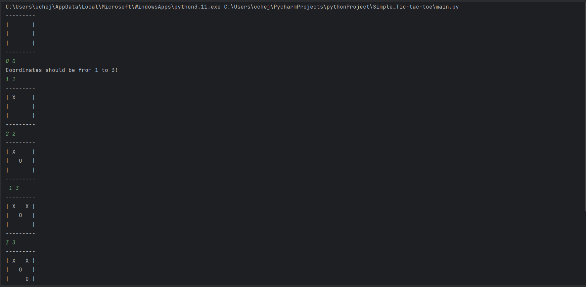
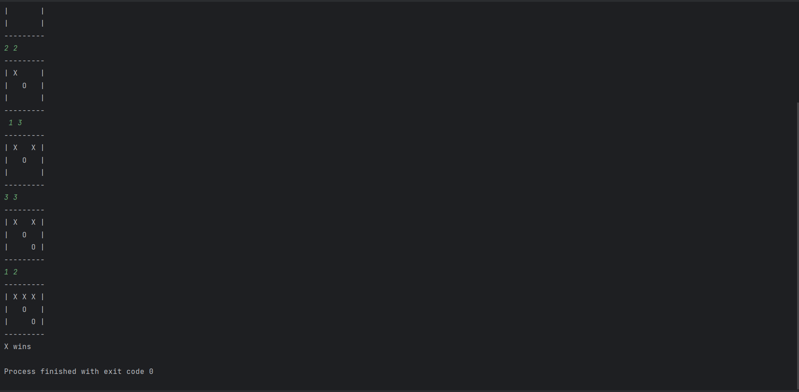

# Tic-Tac-Toe
This program consists of several functions that allow a user to play a game of tic-tac-toe with a Partner. Created functions to constantly check the game as the game progresses to prevent impossible moves

